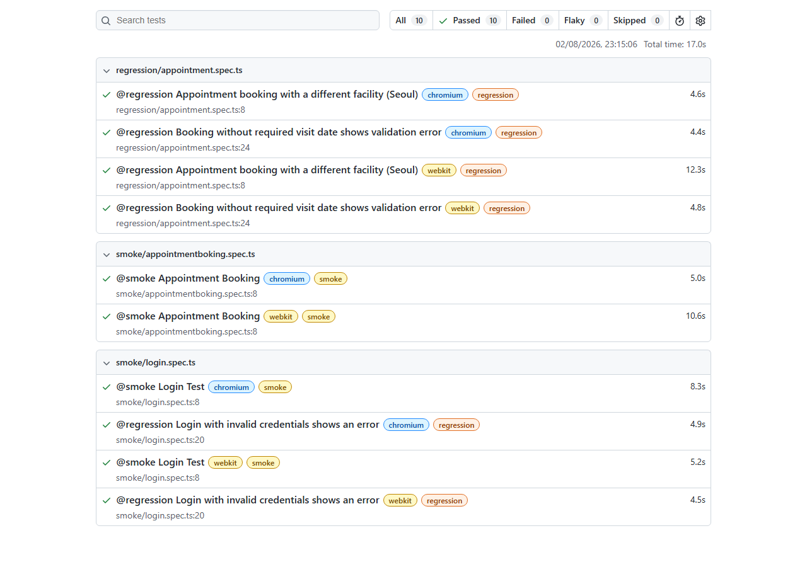

# CURA Healthcare — Playwright Automation Framework

[](https://github.com/Adarsh89P/my_healthCare_playwrightProject/actions/workflows/playwright.yml)

An end-to-end UI test automation framework for the [CURA Healthcare](https://katalon-demo-cura.herokuapp.com/) demo application, built with Playwright and TypeScript using the Page Object Model. It covers the login and appointment-booking flows across Chromium, Firefox, and WebKit, with tagged smoke/regression suites, environment-based configuration, and Allure + HTML reporting wired into CI.

## Test report



## Tech stack

| Area           | Tool                                             |
|----------------|---------------------------------------------------|
| Test runner    | [Playwright Test](https://playwright.dev/) (TypeScript) |
| Design pattern | Page Object Model (`BasePage` + page classes)      |
| Reporting      | Playwright HTML reporter, [Allure](https://allurereport.org/) |
| Logging        | [winston](https://github.com/winstonjs/winston)   |
| Env config     | [dotenv](https://github.com/motdotla/dotenv), switched via `TEST_ENV` |
| CI             | GitHub Actions (smoke job → regression job)        |

## Architecture / folder structure

```
├── .github/workflows/playwright.yml   # CI: smoke job, then regression job, uploads reports as artifacts
├── playwright.config.ts               # Loads .env.<TEST_ENV>, browser projects, reporters, CI settings
├── src/
│   ├── config/env.ts                  # Reads BASE_URL etc. from process.env (populated by dotenv)
│   ├── fixtures/baseFixture.ts        # Custom Playwright test fixture that injects page objects
│   ├── pages/
│   │   ├── BasePage.ts                # Shared Locator-based actions (click, fill, expectVisible, ...)
│   │   ├── loginPage.ts               # Login page object
│   │   └── AppointmentPage.ts         # Appointment booking page object (extends BasePage)
│   ├── testdata/user.json             # Test data: credentials, facilities, etc.
│   └── utils/logger.ts                # winston logger
├── tests/
│   ├── smoke/                         # @smoke — golden-path checks (login, booking)
│   └── regression/                    # @regression — negative paths & extra flows
├── .env.example                       # Template for local .env.uat / .env.live files (no real secrets)
└── docs/test-report-screenshot.png
```

Every page object extends `BasePage`, which wraps common Playwright actions (`click`, `fill`, `expectVisible`, `selectDropdown`, ...) around `Locator` objects — no raw CSS-selector strings are passed around at the test level.

## Setup

```bash
npm ci
npx playwright install --with-deps
```

Copy the example env file and adjust if needed (the defaults already point at the public CURA demo instance):

```bash
cp .env.example .env.uat
```

## Running tests

```bash
npm test                 # everything, all 3 browsers (chromium, firefox, webkit)
npm run test:smoke       # only @smoke-tagged tests
npm run test:regression  # only @regression-tagged tests
npm run test:headed      # run headed, useful for debugging locally
npm run report           # open the last HTML report
```

Tag-based filtering also works directly through the Playwright CLI, e.g. `npx playwright test --grep @smoke --project=chromium`.

### Environment switching

`playwright.config.ts` reads `TEST_ENV` (defaults to `uat`) and loads the matching `.env.<TEST_ENV>` file via `dotenv` **before** the config or any test file is evaluated. `src/config/env.ts` then exposes the resolved values (e.g. `currentenv.baseUrl`) to tests and page objects.

```bash
TEST_ENV=uat npx playwright test    # loads .env.uat  (default)
TEST_ENV=live npx playwright test   # loads .env.live
```

`.env.uat`, `.env.live`, and `.env` are all git-ignored — only `.env.example` (placeholder values, no secrets) is committed. CI supplies the required variables directly as workflow environment variables instead of a committed env file (see the comment in `.github/workflows/playwright.yml` — these are CURA's own published public demo credentials, not real secrets).

## CI

`.github/workflows/playwright.yml` runs on every push/PR to `main`/`master`:

1. **Smoke Test Execution** — runs `@smoke` tests across all configured browsers.
2. **Regression Test Execution** — runs after smoke passes, executes `@regression` tests.

Both jobs upload the Playwright HTML report and the raw Allure results as downloadable CI artifacts (see the **Artifacts** section of any workflow run in the [Actions tab](https://github.com/Adarsh89P/my_healthCare_playwrightProject/actions)). To view the Allure report from a CI run locally:

```bash
# after downloading and unzipping the "smoke-allure-results" or "regression-allure-results" artifact
npx allure generate <path-to-downloaded-results> --clean -o allure-report
npx allure open allure-report
```

On CI, `fullyParallel` is on, `forbidOnly` blocks accidental `test.only` commits, and failed tests retry twice (all gated behind `process.env.CI`).
