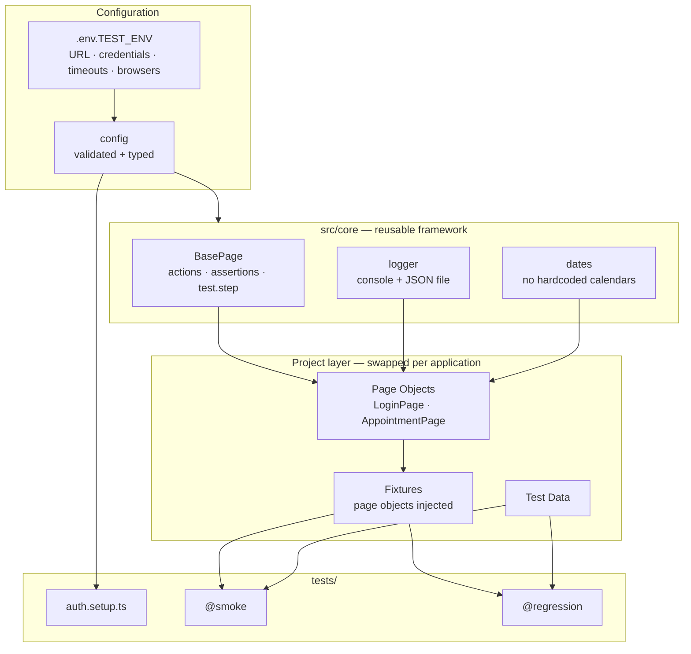
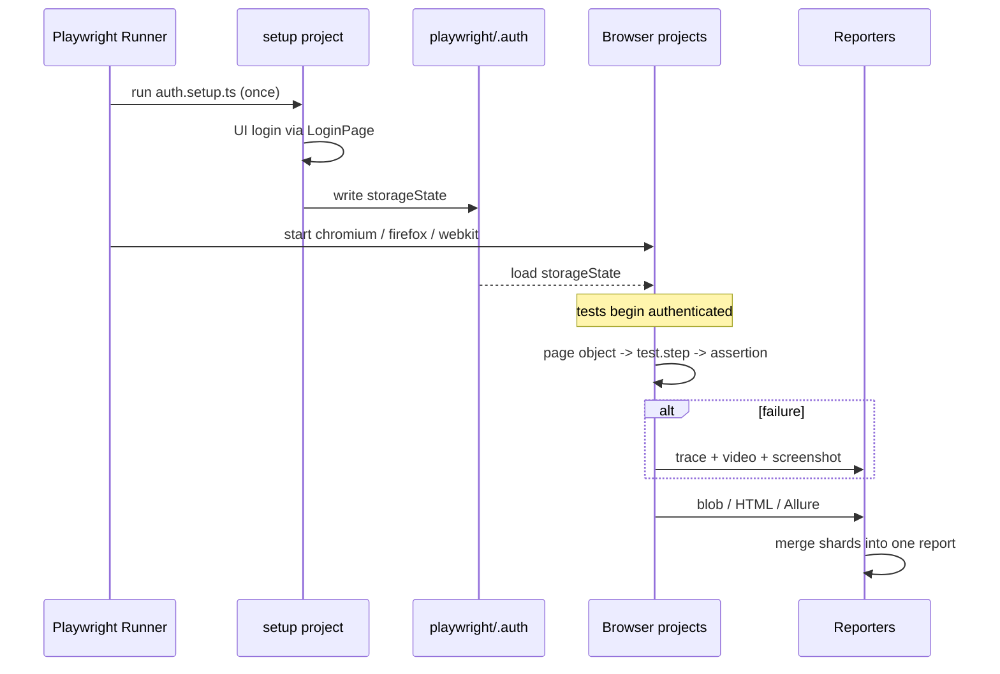

# Playwright Automation Framework

> A reusable Playwright + TypeScript E2E framework you point at any web app by editing one `.env` file — with sharded CI, once-per-run authentication, and trend-tracking Allure reports.

[](https://github.com/Adarsh89P/my_healthCare_playwrightProject/actions/workflows/playwright.yml)
[](https://playwright.dev/)
[](https://www.typescriptlang.org/)
[](https://nodejs.org/)
[](https://allurereport.org/)
[](LICENSE)

The repo ships with a working reference suite against the public
[CURA Healthcare](https://katalon-demo-cura.herokuapp.com/) demo app, so it runs the moment you
clone it.

---

## What this framework demonstrates

- **Configuration is a contract, not a convention.** A single validated `config` object owns every
  environment value. Nothing else reads `process.env`, so a missing variable fails once at startup
  with a message naming the fix — instead of surfacing as `undefined` three call frames deep.
- **A hard reuse boundary.** `src/core/` contains zero application knowledge; `src/pages` and
  `tests/` contain all of it. Retargeting the framework at a different product touches the second
  group only.
- **Authentication is a dependency, not a step.** A `setup` project signs in once and persists
  `storageState`; every browser project declares `dependencies: ['setup']`. Tests start
  authenticated instead of replaying a four-interaction UI login on every spec.
- **Abstractions must earn their indirection.** `BasePage` wrappers exist because they emit named
  `test.step` entries and forward Playwright's own options — not to alias `locator.click()`. Where
  a wrapper would add nothing, page objects call Playwright directly.
- **Correctness is enforced by the pipeline, not by discipline.** Strict TypeScript, ESLint with
  `eslint-plugin-playwright`, and Prettier run as a blocking CI gate before a single browser starts.

---

## Architecture



### Execution flow



---

## Project structure

```
├── .github/workflows/playwright.yml  # quality gate → 4 sharded jobs → merged report
├── Dockerfile                        # pinned to the verified Playwright version
├── playwright.config.ts              # timeouts, reporters, browser projects
├── tsconfig.json                     # strict + @core/@pages/@fixtures/@data aliases
├── eslint.config.mjs                 # TypeScript + Playwright lint rules
├── .env.example                      # every supported variable, documented
│
├── src/
│   ├── core/                         # ══ REUSABLE — no app knowledge ══
│   │   ├── base/BasePage.ts          #    action + assertion wrappers, test.step reporting
│   │   ├── config/env.ts             #    validated, typed, lazily-resolved configuration
│   │   └── utils/
│   │       ├── logger.ts             #    winston — console + JSON file transport
│   │       └── dates.ts              #    relative-date helpers
│   │
│   ├── ai/                           # ══ OPTIONAL — off unless AI_ENABLED ══
│   │   ├── client.ts                 #    Anthropic wrapper; never throws, always degrades
│   │   ├── parse.ts                  #    pure parsing + DOM redaction (unit-tested)
│   │   ├── failure-triage/           #    classify failures, attach verdict to the report
│   │   ├── self-healing/             #    suggest replacement locators (never auto-commits)
│   │   ├── test-generator/           #    story / OpenAPI -> draft specs
│   │   └── flaky-analyzer/           #    rank intermittent failures across runs
│   │
│   ├── pages/                        # ══ PROJECT-SPECIFIC ══
│   │   ├── LoginPage.ts              #    login journey + failure assertions
│   │   └── AppointmentPage.ts        #    booking form, datepicker, confirmation checks
│   ├── fixtures/index.ts             #    page objects injected as fixtures
│   └── testdata/facilities.ts        #    non-secret test data
│
├── tests/
│   ├── setup/auth.setup.ts           # signs in once → playwright/.auth/user.json
│   ├── smoke/                        # @smoke — golden paths
│   ├── regression/                   # @regression — negative + data-driven cases
│   └── unit/                         # AI parsing + fallback logic (no browser, no network)
│
└── docs/                             # report screenshots
```

---

## How to run

**Prerequisites** — Node.js 20+, npm 10+. Docker only for the container route.

```bash
npm ci
npx playwright install --with-deps

cp .env.example .env.uat        # then set BASE_URL and credentials
```

| Goal                        | Command                             |
| --------------------------- | ----------------------------------- |
| Everything                  | `npm test`                          |
| Smoke only                  | `npm run test:smoke`                |
| Regression only             | `npm run test:regression`           |
| One browser (fastest loop)  | `npm run test:chromium`             |
| Pick browsers explicitly    | `BROWSERS=chromium,webkit npm test` |
| Watch it happen             | `npm run test:headed`               |
| Time-travel debugging       | `npm run test:ui`                   |
| Step through                | `npm run test:debug`                |
| Against `.env.live`         | `npm run test:live`                 |
| Unit tests only             | `npm run test:unit`                 |
| Quality gate (what CI runs) | `npm run verify`                    |

### Docker

```bash
npm run docker:build
npm run docker:test          # mounts playwright-report/ back to the host
```

The image is `mcr.microsoft.com/playwright:v1.61.0-noble`, pinned to the same Playwright version as
`package.json`, so container runs use the exact browser builds the suite was verified against.

### Selenium Grid / remote browsers

Playwright does not use Selenium Grid. The equivalent is connecting to a remote browser server:

```bash
# On the host machine
npx playwright run-server --port 3000

# On the runner
PW_TEST_CONNECT_WS_ENDPOINT=ws://<host>:3000/ npm test
```

<!-- TODO: remote/grid execution has not been verified for this repo. The snippet above is the
     standard Playwright pattern, not a measured configuration. -->

---

## Reporting

| Report                     | Where it lands                       | How to open                                                         |
| -------------------------- | ------------------------------------ | ------------------------------------------------------------------- |
| Playwright HTML            | `playwright-report/`                 | `npm run report`                                                    |
| Allure                     | `allure-results/` → `allure-report/` | `npm run allure:serve`                                              |
| Allure (CI, with history)  | GitHub Pages                         | <!-- TODO: add the gh-pages URL once the first CI run publishes --> |
| Winston JSON log           | `test-results/logs/test-run.log`     | any log viewer                                                      |
| Trace / video / screenshot | `test-results/`                      | `npx playwright show-trace <path>`                                  |

Every `BasePage` action emits a named `test.step`, so both reports read as a legible sequence
("Click button[type=submit]" → "Expect #facility to have text …") rather than a wall of raw calls.


<!-- TODO: docs/report.png does not exist yet. Run `npm test && npm run report`, screenshot the
     summary, and save it as docs/report.png. The existing docs/test-report-screenshot.png shows an
     older 10-test run and is stale. -->

---

## CI/CD

Three chained jobs in [.github/workflows/playwright.yml](.github/workflows/playwright.yml):

1. **`quality`** — typecheck, lint, format check. Fails in under a minute, before any browser boots.
2. **`test`** — 4 parallel shards × 3 browsers, browser binaries cached against the Playwright
   version. Each shard emits a `blob` report.
3. **`report`** — merges shards into one HTML report and publishes Allure (20 runs of history) to
   GitHub Pages.

| Trigger                        | What runs                                                                                                      |
| ------------------------------ | -------------------------------------------------------------------------------------------------------------- |
| Push to default / `feature/**` | Full pipeline — quality → sharded tests → merged report                                                        |
| Pull request                   | Same, with `concurrency` cancelling superseded runs                                                            |
| **Nightly, 02:00 UTC**         | Full suite across all three browsers — catches environment drift and slow-burn flakiness a per-push run misses |
| Manual (`workflow_dispatch`)   | Choose `all` / `smoke` / `regression` from the Actions tab                                                     |

`BASE_URL` comes from a repository **variable** and credentials from repository **secrets**, so the
workflow is reusable across projects without edits.

---

## Key design decisions and trade-offs

**Authenticate once, not per test.**
A `setup` project performs the UI login and saves `storageState`; every browser project depends on
it. This removes four interactions from every test. The trade-off is that the login path itself is
then exercised only by the dedicated auth specs — which opt out with
`test.use({ storageState: { cookies: [], origins: [] } })`. On an app with a login API, the setup
project should call that API instead of driving the UI.

**Wrappers that report, not wrappers that alias.**
A `BasePage` method that only calls `locator.click()` is pure indirection and hides Playwright's
option arguments. These wrappers justify themselves by emitting `test.step` entries and forwarding
options through. The cost is one more layer to learn; the benefit is a report a non-author can read.
Relatedly, `BasePage.isVisible()` deliberately _waits_ before answering, unlike Playwright's
non-retrying `locator.isVisible()`, which is a common source of flakiness.

**Typed test data over JSON files.**
Test data lives in `src/testdata/*.ts`, not `*.json`. JSON is more familiar and tooling-agnostic;
typed modules catch a renamed field at compile time and support derived values like
`ALL_FACILITIES`. For data a non-engineer must edit, JSON or CSV is the better call — the loader
boundary makes that swap local.

**Never hardcode a calendar date.**
`nearFutureDateInCurrentMonth()` derives dates from today. A literal date that was "in the future"
when written silently rots into the past — this repo previously carried a `2024-12-31` fixture that
had already expired. The trade-off is that date logic is now a helper to understand rather than a
visible constant.

**Chromium locally, all three browsers in CI.**
`BROWSERS` defaults to Chromium for fast local feedback and all three engines in CI for real
coverage. The risk is a browser-specific failure reaching CI rather than being caught locally;
`BROWSERS=chromium,firefox,webkit npm test` closes that gap before pushing.

**Tags over folders.**
Suites are selected by `{ tag: ['@smoke'] }`, not by directory, so a test can be smoke _and_ live in
the auth file. Folders remain for human organisation only — meaning the two can never disagree,
which they previously did.

---

## AI-assisted capabilities

The framework has an optional AI layer in [`src/ai/`](src/ai). It is **off by default**: with
`AI_ENABLED` unset — or with no `ANTHROPIC_API_KEY` present — the suite makes **zero AI calls** and
behaves exactly as it would if the directory did not exist.

### The rule that governs the whole layer

> **AI never gates the pass/fail decision.**

A test passes or fails on its assertions alone. Every AI feature here _annotates_, _suggests_ or
_reports_ — none of them can turn a red test green, or green red. This is a deliberate constraint,
not a limitation: a suite whose verdict depends on a non-deterministic model is not a test suite.

| Concern                | Deterministic                 | AI-assisted                                                     |
| ---------------------- | ----------------------------- | --------------------------------------------------------------- |
| Pass / fail verdict    | ✅ Always                     | ❌ Never                                                        |
| Locator resolution     | ✅ Primary path               | ⚠️ One retry with a _suggested_ selector, flagged in the report |
| Failure classification | —                             | ✅ Advisory verdict attached to the report                      |
| Flakiness detection    | ✅ Scoring is pure arithmetic | ⚠️ Only the "probable cause" prose                              |
| Test case generation   | —                             | ✅ Drafts only, emitted as `test.fixme`                         |

### 1. Failure triage

On a failed test, the error, stack, and a pruned DOM snapshot are classified as
**product-bug · test-bug · environment-issue · flaky**, with confidence and a suggested next step.
The verdict is attached as `ai-triage.md` — visible in both the Playwright HTML report and Allure —
and appended to `test-results/ai/triage-report.jsonl` (JSON Lines, so parallel workers cannot
corrupt each other's writes).

```bash
AI_ENABLED=true ANTHROPIC_API_KEY=sk-ant-... npm test
```

### 2. Self-healing locators — suggest only

When an action fails, the failed selector plus the current DOM go to the model, which proposes a
replacement. The suggestion is used for **exactly one retry**, and only if it resolves to exactly
one element. Every suggestion is written to `test-results/ai/healing-report.json` for review.

**Nothing is ever auto-committed.** An auto-applied selector fix that no human reads is a silent way
to stop testing what you think you are testing — so healing buys you a passing run _and_ a diff to
review, not a hidden change. Healed actions are logged at `warn` level precisely so they stay
visible.

```bash
AI_ENABLED=true AI_SELF_HEALING=true npm test
```

### 3. Test generator

Turns a user story or an OpenAPI spec into draft positive / negative / boundary cases, plus a
scaffolded spec file.

```bash
npm run ai:generate -- --story "As a patient I want to cancel a booked appointment"
npm run ai:generate -- --openapi ./openapi.json --name booking-api
```

Writes to `generated/`. Every generated test is `test.fixme`, so a draft nobody has read cannot
report a false pass.

### 4. Flaky analyzer

Aggregates several Playwright JSON reports and ranks intermittently failing tests.

```bash
PLAYWRIGHT_JSON_OUTPUT_NAME=ci-runs/run-1.json npx playwright test --reporter=json
npm run ai:flaky -- --input ./ci-runs
```

Scoring is `1 - |2 × failureRate - 1|`: it peaks at a 50/50 split and drops to zero for tests that
always pass **or** always fail. A test that fails every time is broken, not flaky, and conflating
the two buries the real races. The arithmetic runs with AI off; AI only adds probable-cause prose.

### Safety and failure behaviour

- **The key comes from the environment only.** Never committed, never logged, never sent anywhere
  but the Anthropic API.
- **DOM snapshots are pruned before they leave the machine** — `<script>`, `<style>`, comments and
  SVG paths are stripped and the result is capped. Inline scripts are a common home for tokens, so
  this is a privacy measure as much as a token-cost one. See the unit test that asserts it.
- **Every call is capped** at `AI_TIMEOUT_MS` (30s default), so a hung request cannot stall CI.
- **Every failure mode degrades to normal behaviour** — missing key, disabled flag, network error,
  timeout, safety refusal, malformed JSON, or an unexpected response shape all return a typed skip
  reason. `askForJson` never throws.
- **The fallback logic is unit-tested** — 44 tests in [`tests/unit/`](tests/unit) cover JSON
  extraction from fenced/prose responses, confidence clamping, unknown categories, DOM redaction and
  flakiness scoring. They need no browser and no network: `npm run test:unit`.

### Cost control

Triage only fires on failures, healing only on a failed action. **A fully green run makes no AI
calls at all**, regardless of flags.

---

## What I would add next

|                                                  | Why                                                                                                            |
| ------------------------------------------------ | -------------------------------------------------------------------------------------------------------------- |
| **API test layer** (`APIRequestContext`)         | Seed and tear down state via API instead of the UI — faster and less brittle                                   |
| **Visual regression** (`toHaveScreenshot`)       | Catches layout breakage no DOM assertion will                                                                  |
| **Accessibility scans** (`@axe-core/playwright`) | High value on a healthcare product; ~20 lines for real coverage                                                |
| **AI-assisted layer**                            | Failure triage, self-healing locator _suggestions_, flakiness analysis — advisory only, never gating pass/fail |
| **Coverage depth**                               | The current suite is a reference, not a product suite — boundary cases, session expiry, concurrent booking     |
| **Pre-commit hooks** (husky + lint-staged)       | Move the quality gate left, off CI                                                                             |

---

## License

[MIT](LICENSE) © 2026 Adarsh89p
